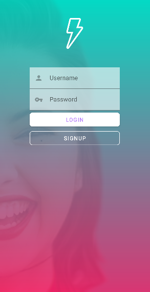
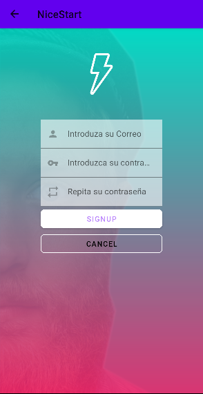
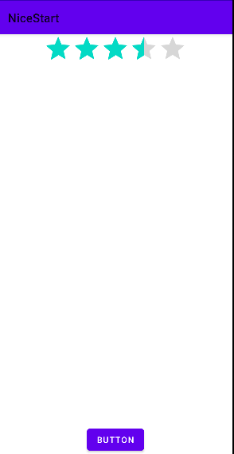

## NICE START

Esto es el readme de mi proyecto de desarrollo de interfaces, el cual tiene como fin crear y desarrollar una aplicación,mientras vamos aprendiendo  
como funciona esta interfaz de desarrollo.

La aplicacion esta compuesta por diferentes vistas que veras a continuacion:

Esta es la primera pantalla que se reproducira al abrir la aplicacion, la cual tiene una animación
en el logo y además pasara a la siguiente vista sin necesidad de tocar la pantalla
después de un pequeño periodo de tiempo.

Aqui se puede apreciar la segunda vista que tendriamos, la vista de login ,
nos puede redirigir  a traves de botones, a la pestaña main o en cambio a la pestaña register que vemos
a continuacion...

Esta pantalla es la de register que consta de tres campos diferentes y dos botones para ser redirigido a diferentes
paginas ademas de tener una flecha en la barra superior de la vista para poder volver a la vista anterior.

Aqui tendriamos una vista que constiste en un refresh, esto quiere decir  que al acutualizar la vista nos sale aleatoriamente  
una foto de otra persona que no sea la anterior, conectada a otra pagina web de fotos de personas(no reales).

Esta vista es la vista main, esta todavia en proceso pero lo que podemos apreciar es una vista que tiene una valoración
de la aplicación y un boton para enviar los datos, pero como he dicho anteriormente falta perfeccionarla del todo.

También me gustaria hacer referencia a que he trabajado con Jaime el compañero de clase con el que me he puesto de acuerdo,
para realizar un pull request cada uno al otro añdaiendonos animaciones nuevas a la carpeta de animaciones.